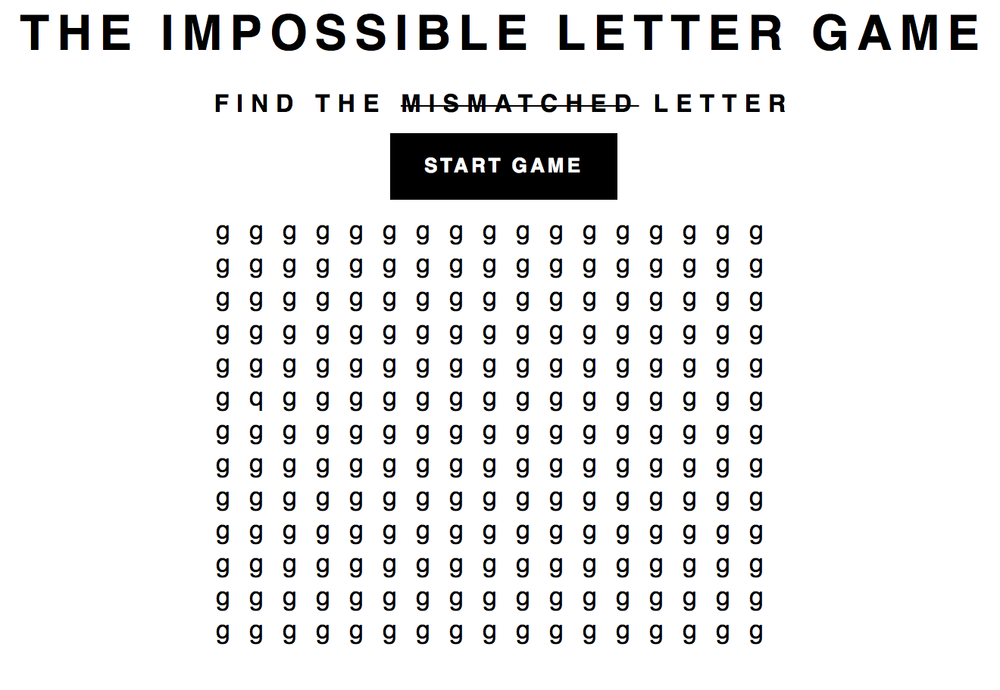

# THE IMPOSSIBLE LETTER GAME

## Introduccion

Vamos a generar un juego utilizando JQuery, en el cual presionando sobre la letra incorrecta ganaremos el juego.

Deberiamos conseguir llegar a algo similar a lo que se muestra en la siguiente imagen.

## Instrucciones

1. Maquetar el sitio similar a la imagen.
1. Generar una matriz de 16x12 de letras g o n.
1. Reemplazar aleatoriamente una letra por una q o r (Dependiendo si escogieron g o n relativamente).
    **TIP:** Pueden utilizar la funcion *[Math.random()](https://developer.mozilla.org/es/docs/Web/JavaScript/Referencia/Objetos_globales/Math/random)* para cambiar la letra aleatoriamente. 
1. Reemplazar la matriz maquetada por contenido generado dinamicamente desde JS.
1. Agregar un evento al boton `Start Game` para que al ser presionado genere una nueva matriz.
1. Agregar un evento a cada caracter y validar que se haya encontrado la letra.
1. Si el usuario encontro la letra, mostrar un mensaje.
    **TIP:** El mensaje puede ser un alert o para completar el juego, podria mostrarse un mensaje en el DOM.
